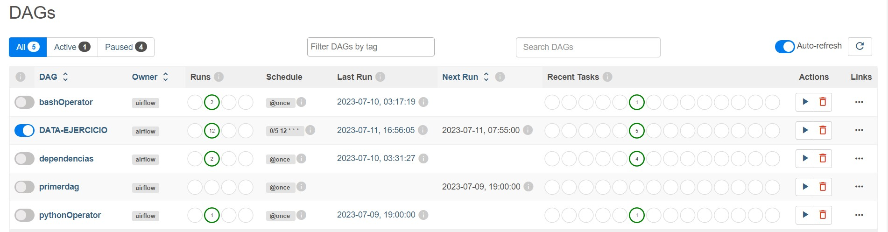
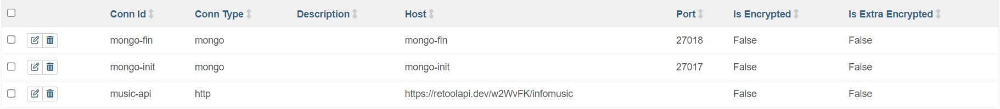
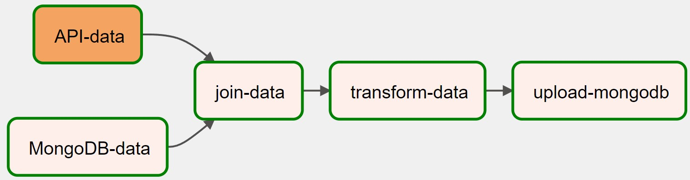
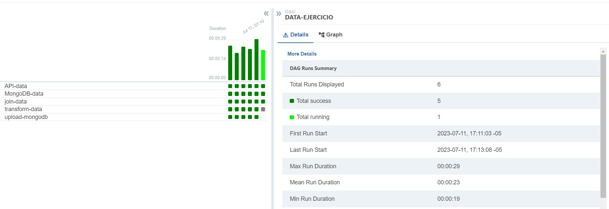

# Implementació de APache Airflow

# Ejemplo de Apache Airflow: Obtener los datos de una API y MongoDB, 

Este ejemplo demuestra la implementación de un DAG (Grafo Acíclico Dirigido) de Apache Airflow que obtiene datos de una API y MongoDB, los une y guarda el resultado en otra colección de MongoDB. El DAG está programado para ejecutarse cada 5 minutos a partir del 11 de julio de 2023.

## Detalles del DAG

- **ID del DAG**: DATA-EJERCICIO
- **Descripción**: Obtiene datos de una API y MongoDB, y los une en otra colección de MongoDB.
- **Intervalo de programación**: Cada 5 minutos a partir de las 12:00 en adelante.
- **Fecha de inicio**: 11 de julio de 2023
- **Fecha de finalización**: 11 de octubre de 2023
- **Argumentos predeterminados**:
  - `depends_on_past`: True (Las tareas dependen de las ejecuciones anteriores)
- **Ejecuciones activas máximas**: 1 (Asegura que solo haya una instancia activa del DAG a la vez)

## Tareas

### Tarea 1 (t1): Obtener datos de la API

- **ID de la tarea**: API-data
- **Método HTTP**: GET
- **ID de conexión HTTP**: music-api
- **Encabezados**: Content-Type: application/json
- **XCom Push**: Habilitado

Esta tarea obtiene datos de una API utilizando el operador `SimpleHttpOperator`.

### Tarea 2(t2): Obtener datos de MongoDB

- **ID de la tarea**: MongoDB-data
- **Función Python**: get_data_mongo
- **XCom Push**: Habilitado

Esta tarea se conecta a MongoDB utilizando el `MongoHook` y obtiene datos de la colección `music`. Los datos obtenidos se almacenan en un DataFrame de pandas y se convierten al formato JSON.

### Tarea 3(t3): Unir datos de la API y MongoDB

- **ID de la tarea**: join-data
- **Función Python**: join_data
- **XCom Push**: Habilitado

Esta tarea une los datos obtenidos de la API (Tarea 1) y MongoDB (Tarea 2) utilizando DataFrames de pandas. Agrega columnas faltantes a los datos de la API, filtra los datos de MongoDB según el último ID de la API y concatena los datos filtrados. El DataFrame resultante se convierte al formato JSON y se almacena en el contexto de XCom.

### Tarea 4(t4): Transformar datos unidos

- **ID de la tarea**: transform-data
- **Función Python**: transform_data
- **XCom Push**: Habilitado

Esta tarea transforma los datos unidos (Tarea 3) seleccionando las columnas necesarias y renombrándolas. El DataFrame transformado se convierte al formato JSON y se almacena en el contexto de XCom.

### Tarea 5(t5): Cargar datos transformados en MongoDB

- **ID de la tarea**: upload-mongodb
- **Función Python**: upload_data_mongo
- **DAG**: DATA-EJERCICIO
- **XCom Push**: Habilitado

Esta tarea se conecta a otra instancia de MongoDB (`mongo-fin`) utilizando el `MongoHook` y carga los datos transformados (Tarea 4) en la colección `musicDef`.

## Dependencias

- La Tarea 1 (`API-data`) y la Tarea 2 (`MongoDB-data`) se ejecutan en paralelo.
- La Tarea 3 (`join-data`) depende de la finalización exitosa de la Tarea 1 (`API-data`) y la Tarea 2 (`MongoDB-data`).
- La Tarea 4 (`transform-data`) depende de la finalización exitosa de la Tarea 3 (`join-data`).
- La Tarea 5 (`upload-mongodb`) depende de la finalización exitosa de la Tarea 4 (`transform-data`).

## Configuración de Docker Compose

Se utiliza el archivo [`docker-compose.yaml`](https://airflow.apache.org/docs/apache-airflow/2.6.3/docker-compose.yaml) recomendado proporcionado por Airflow con algunas modificaciones:

## Configuración del web server de Airflow

En la seccion de environmente del airflow-webserver se cambia el valor de **true** por **false** para no cargar los ejemplos

- AIRFLOW__CORE__LOAD_EXAMPLES=false

## Configuración de los Servicios de MongoDB

### Servicio `mongo-init`:

- `image: mongo`: Indica que el servicio utilizará la imagen de Docker de MongoDB.
- `ports: - 27017:27017`: Mapea el puerto 27017 del contenedor al puerto 27017 del host, lo que permite acceder al servidor de MongoDB dentro del contenedor desde el host en el mismo puerto.
- `volumes: - ./mongodb/db:/data/db`: Establece un volumen que vincula el directorio `./mongodb/db` en el host con el directorio `/data/db` dentro del contenedor de MongoDB. Esto permite persistir los datos de MongoDB en el host incluso después de que se detenga el contenedor.
- `restart: always`: Configura el servicio para que se reinicie automáticamente si se detiene por algún motivo.

### Servicio `mongo-fin`:

- `image: mongo`: Indica que el servicio utilizará la imagen de Docker de MongoDB.
- `ports: - 27018:27017`: Mapea el puerto 27017 del contenedor al puerto 27018 del host. Esto permite acceder a este servidor de MongoDB específico utilizando el puerto 27018 en el host.
- `volumes: - ./mongodb/db2:/data/db`: Vincula el directorio `./mongodb/db2` en el host con el directorio `/data/db` dentro del contenedor de MongoDB. Esto separa los datos de MongoDB de este servicio en particular en un directorio diferente en el host.
- `restart: always`: Configura el servicio para que se reinicie automáticamente si se detiene.

## Imágenes

### DAG en Airflow

### Lista de Conexiones en Airflow

### Gráfico del DAG en Airflow

### Ejecución del Grid en Airflow

